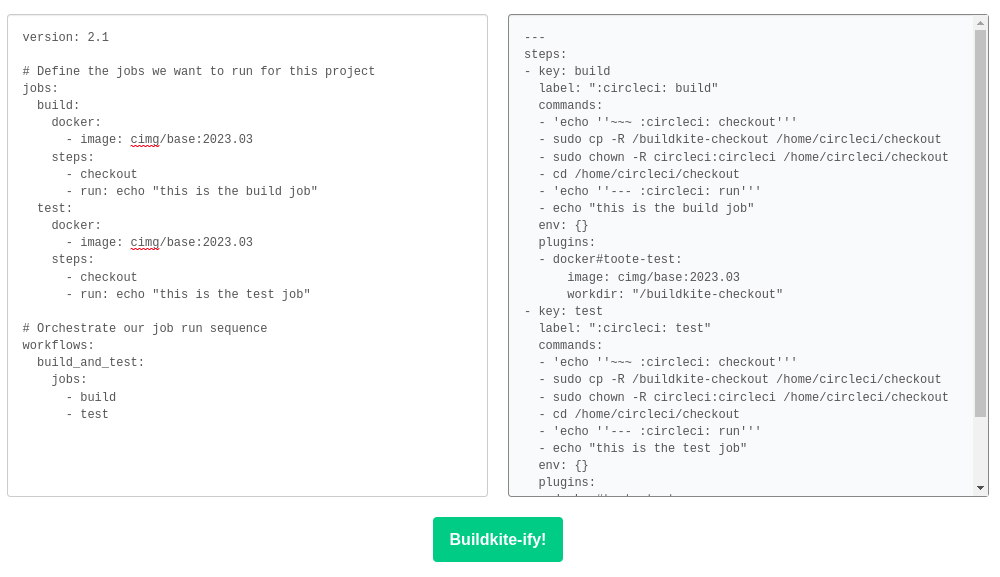

# Buildkite Migration tool

A tool to transform pipelines from other CI providers to Buildkite.

```shell
$ cat examples/circleci/basic.yml
version: 2
jobs:
  build:
    docker:
      - image: circleci/python:3.6.2-stretch-browsers
    steps:
      - checkout
      - run: pip install -r requirements/dev.txt

$ buildkite-compat examples/circleci/basic.yml
steps:
- label: ":circleci: build"
  key: "build"
  commands:
    - "sudo cp -R /buildkite-checkout /home/circleci/checkout"
    - "sudo chown -R circleci:circleci /home/circleci/checkout"
    - "cd /home/circleci/checkout"
    - "pip install -r requirements/dev.txt"
  plugins:
  - docker#v3.3.0:
      image: "circleci/python:3.6.2-stretch-browsers"
      workdir: "/buildkite-checkout"
```

Note that setting the environment variable `BUILDKITE_PLUGIN_<UPPERCASE_NAME>_VERSION` will override the default version of the plugins used. For example:

```shell
$ BUILDKITE_PLUGIN_DOCKER_VERSION=testing-branch buildkite-compat examples/circleci/basic.yml
steps:
- label: ":circleci: build"
  key: "build"
  commands:
    - "sudo cp -R /buildkite-checkout /home/circleci/checkout"
    - "sudo chown -R circleci:circleci /home/circleci/checkout"
    - "cd /home/circleci/checkout"
    - "pip install -r requirements/dev.txt"
  plugins:
  - docker#testing-branch:
      image: "circleci/python:3.6.2-stretch-browsers"
      workdir: "/buildkite-checkout"
```

## Web Service/API

Buildkite Compat can also be used via a HTTP API using `rackup` from the `app` folder of this repository.

Note that if you are using the docker image you will have to override the entrypoint:
```shell
$ docker run --rm -ti -p 9292:9292 --entrypoint '' --workdir /app $IMAGE:$TAG rackup --port 9292
```

After that you should be able to access a very simple web interface at http://localhost:9292 



You could also programatically interact with it (maybe even pipe the output directly to `buildkite-agent pipeline upload`!):

```shell
$ curl -X POST -F 'file=@app/examples/circleci/basic.yml' http://localhost:9292
steps:
- label: ":circleci: build"
  key: build
  commands:
  - sudo cp -R /buildkite-checkout /home/circleci/checkout
  - sudo chown -R circleci:circleci /home/circleci/checkout
  - cd /home/circleci/checkout
  - pip install -r requirements/dev.txt
  plugins:
  - docker#v3.3.0:
      image: circleci/python:3.6.2-stretch-browsers
      workdir: "/buildkite-checkout"
```
